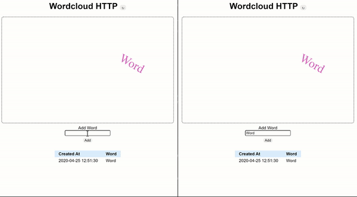
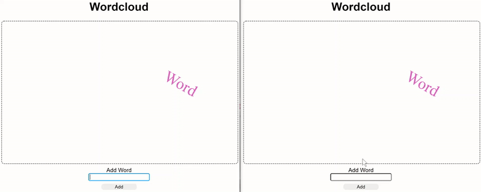

# Wordcloud http frontend

A javascript react project to demonstrate the difference of `http requests` vs. `sockets` to receive and push data to a backend.

[](https://codesandbox.io/s/github/GBSL-Informatik/wordcloud-frontend-skeleton)

This should be used in combination with the [wordcloud-server](https://github.com/GBSL-Informatik/wordcloud-server-skeleton).


## HTTP version

With `PROTOCOL = "http";` in `src/App.js`:


Remark that the pull behavior of the application - the client has to actively refresh the page to get the updates from the wordcloud server.

## Socket Version

With `PROTOCOL = "socket";` in `src/App.js`:


Remark that the push behavior of the server - the client receives the updates without any action of the user.


## install

```sh
yarn install
```

## run
```sh
yarn start
```

## Codesandbox

1. Make sure to first start a [Wordcloud-Server Sandbox](https://codesandbox.io/s/github/GBSL-Informatik/wordcloud-server-skeleton):
  
    [](https://codesandbox.io/s/github/GBSL-Informatik/wordcloud-server-skeleton)

2. Copy the URL of the *Wordcloud-Server Sandbox* instance and replace the value of the variable `API_URL` in `App.js` with the wordcloud server url.

    !! The URL should not have a trailing slash `/`
